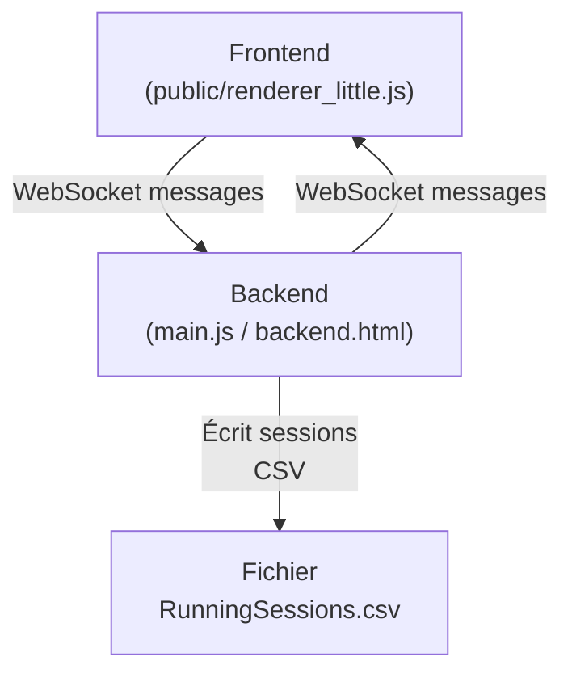

# Treadmill App

Application Electron pour la gestion d'un tapis de course connecté (simulateur backend HTML/JS).

## 🚀 Présentation
Cette application permet de simuler et d'afficher en temps réel les données d'un tapis de course, avec une interface utilisateur en français, un mode plein écran, et une communication WebSocket avec un backend simulé.

## 🏁 Fonctionnalités principales
- Affichage en plein écran sans barre de menu
- Interface utilisateur en français
- Réception des données de vitesse en temps réel via WebSocket
- Calcul et affichage de la distance, vitesse instantanée, moyenne, maximale
- Message de bienvenue, puis affichage des compteurs, puis écran de résultats
- Affichage du classement global après chaque session
- Export des sessions au format CSV (compatible Excel)
- Synchronisation des paramètres (coefficient, fréquence, etc.) entre frontend et backend
- Raccourci de maintenance : triple clic/tap coin haut gauche pour RESET

## ⚙️ États de l'application
- **idle** : Accueil, attente de mouvement
- **idle (message de bienvenue)** : Message affiché dès que la vitesse > 0.1 km/h
- **running** : Course en cours, compteurs affichés dès que la vitesse >= vMin
- **results** : Affichage des résultats de la session et du classement global

## 🔄 Transitions principales
- **idle → idle (message de bienvenue)** : vitesse > 0.1 km/h
- **idle (message de bienvenue) → running** : vitesse >= vMin
- **running → results** : vitesse < vMin pendant pauseDurationBeforeEnd OU vitesse < 0.1 km/h après le délai
- **results → idle** : après expiration du temps d'affichage des résultats (resultsDisplayDuration) ou clic sur "Retour à l'accueil"
- **RESET** : triple clic/tap coin haut gauche → retour à l'état initial

## 🗃️ Export CSV
- À chaque fin de séance, la session est enregistrée dans `RunningSessions.csv` (avec BOM UTF-8)
- **Emplacement : dossier « Documents » de l'utilisateur**
- Colonnes : Date ; Durée (hh:mm:ss) ; Distance ; Vitesse moyenne ; Vitesse max

## 🔌 Communication backend
- WebSocket sur port 8765
- Messages structurés (voir code pour détails)
- Backend simulé en HTML/JS (fichier `backend.html`)

## 🛠️ Installation
1. Cloner le dépôt ou copier les fichiers dans un dossier
2. Installer les dépendances Node.js :
   ```bash
   npm install
   ```
3. Lancer l'application :
   ```bash
   npm start
   ```

## 🖥️ Structure du projet
- `main.js` : Processus principal Electron
- `public/renderer_little.js` : Logique frontend (affichage, états, WebSocket, CSV)
- `backend.html` : Simulateur backend (WebSocket, capteurs simulés)
- `public/` : Fichiers statiques (HTML, CSS)
- `RunningSessions.csv` : Export des sessions

## 🧑‍💻 Raccourcis et maintenance
- **Triple clic/tap coin haut gauche** : RESET global (frontend + backend)
- **Bouton de configuration** : Modifier les paramètres (coefficient, fréquence, etc.)

## 📄 Licence
Projet pédagogique ou privé. À adapter selon vos besoins.

## 🗺️ Schéma d'architecture



## 🗃️ Exemple de ligne CSV

```
2024-06-01 15:23:45;00:12:34;1234,5;8,2;12,7
```

*Format : Date;Durée (hh:mm:ss);Distance (m);Vitesse moyenne (km/h);Vitesse max (km/h)*

## ⌨️ Raccourcis clavier utiles

- **Espace** : Ouvre la fenêtre de configuration
- **F12** : Ouvre les DevTools (outils de développement)
- **Triple clic/tap coin haut gauche** : RESET global (frontend + backend)

## 📦 Distribution et build

- L'application Electron est conçue pour être buildée et distribuée (voir outils comme electron-builder ou electron-forge).
- **Le fichier CSV n'est jamais inclus dans la build** : il est généré dynamiquement dans le dossier « Documents » de l'utilisateur, pour garantir l'accès et la compatibilité avec Excel.
- **Le backend (`backend.html`) n'est pas inclus dans la version finale** : il s'agit uniquement d'un simulateur pour les tests et le développement. 